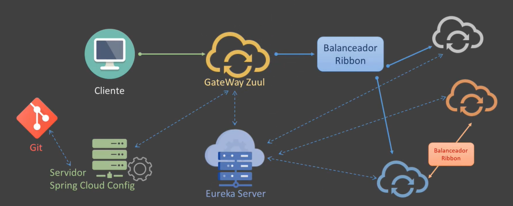

# spring-boot-microservices

TRUST YOURSELF 🚀✨

# Technologies
- Java 17
- Spring Boot
- Spring IoC
- Spring Data e Hibernate
- H2
- Spring Cloud
- Servidor Eureka Netflix
- Eureka Client
- LoadBalancer
- RestTemplate (sync)
- Feign (sync)
- 
- Gateway Zuul
- Spring Cloud Server Config
- Spring Security OAuth2
- JWT
- Lombok
- MapStruct
- Docker, Docker File, Docker Compose
- AWS

# Architecture

